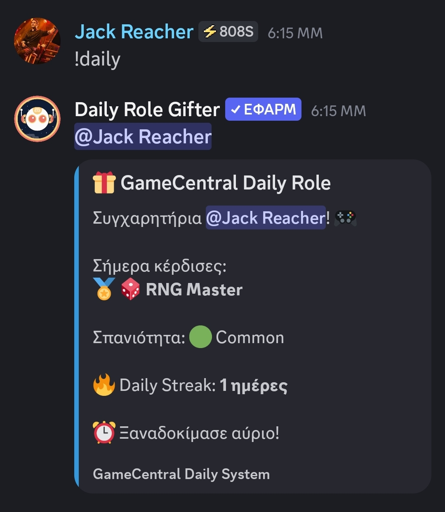
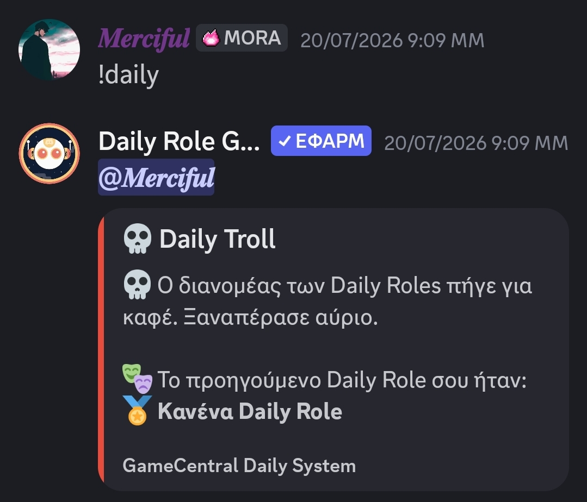
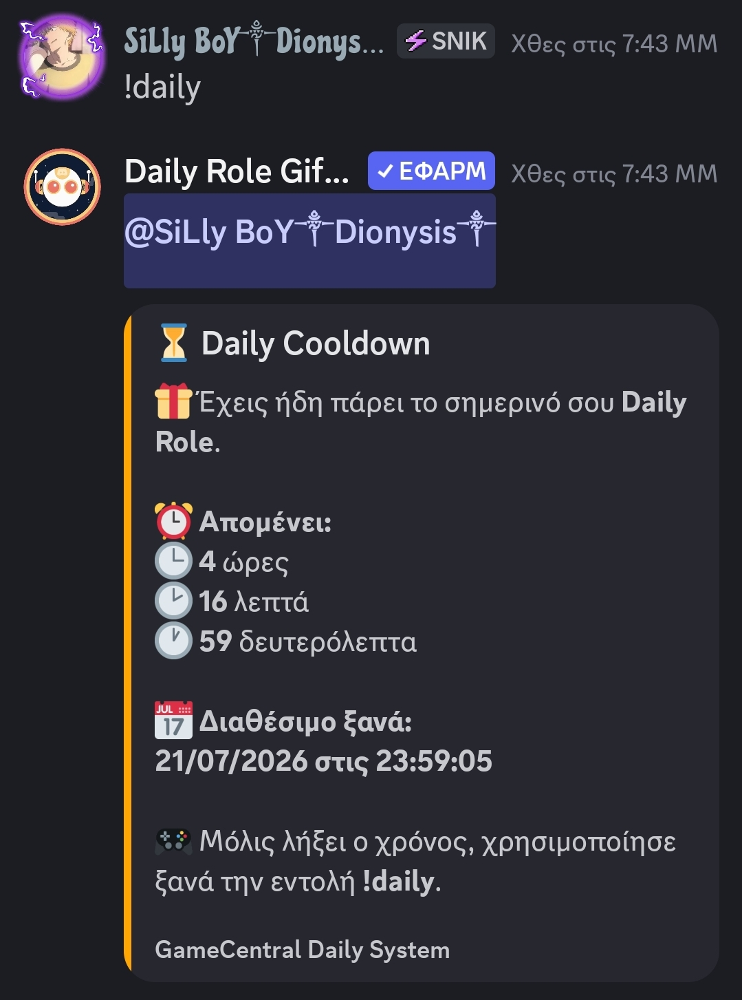

# 🎁 YAGPDB Advanced Daily Roles

An advanced Daily Role reward system for YAGPDB Custom Commands.

Give your Discord community a reason to return every day with random role rewards, rarity tiers and progression mechanics.

---

## ✨ Features

- 🎁 Daily random role rewards
- ⭐ Rarity system:
  - 🟢 Common
  - 🔵 Rare
  - 🟣 Epic
  - 🟡 Legendary
- 🎯 Pity system (increases chances after unlucky rolls)
- 🔥 Daily streak tracking
- 😂 Troll events
- 🔄 Automatic replacement of previous Daily Role
- ⏳ 24-hour cooldown system
- 💬 Custom Discord embeds

---

## 📸 Preview

### 🎁 Daily Reward

### 💀 Troll Event

### ⏳ Cooldown

---

## 📋 Requirements

- YAGPDB Discord Bot
- Custom Commands enabled
- Manage Roles permission
- Role hierarchy configured correctly

---

## 🚀 Installation

1. Create a new YAGPDB Custom Command.
2. Copy the code from `daily_roles.yag`.
3. Paste it into your Custom Command.
4. Replace the Role IDs with your own Discord Role IDs.
5. Save and test the command.

---

## ⚙️ Configuration

Before using the command, customize:

- Role IDs
- Cooldown duration
- Rarity chances
- Messages
- Embed settings

---

## 🎲 Rarity System

Default rarity chances:

| Rarity | Chance |
|---|---|
| 🟢 Common | 60% |
| 🔵 Rare | 28% |
| 🟣 Epic | 10% |
| 🟡 Legendary | 2% |

---

## 📈 Roadmap

- [x] Daily Role rewards
- [x] Rarity system
- [x] Troll events
- [x] Pity system
- [x] Daily streaks

---

## 📜 License

This project is licensed under the MIT License.

---

## 👤 Creator

Created by **Ethelior**

Enjoy!
